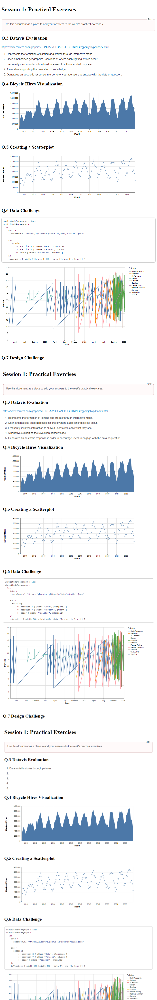

@import "../../lectures/css/datavis.less"

```elm {l=hidden}
import Tidy exposing (..)
import VegaLite exposing (..)
```

<!-- Everything above this line should probably be left untouched. -->

# Session 1: Practical Exercises

{(task|}

Use this document as a place to add your answers to the week's practical exercises.

{|task)}

## Q.3 Datavis Evaluation

https://www.reuters.com/graphics/TONGA-VOLCANO/LIGHTNING/zgpomjdbypd/index.html

1. Represents the formation of lighting and storms through interactive maps.
2. Often emphasises geographical locations of where each lighting strikes occur.
3. Frequently involves interaction to allow a user to influence what they see.
4. A narrative supporting the revelation of knowledge.
5. Generates an aesthetic response in order to encourage users to engage with the data or question.

## Q.4 Bicycle Hires Visualization

```elm { v}
bikehireBarchart : Spec
bikehireBarchart =
    let
        data =
            dataFromUrl "https://gicentre.github.io/data/bicycleHiresLondon.csv"

        enc =
            encoding
                << position X [ pName "Month", pTemporal ]
                << position Y [ pName "NumberOfHires", pQuant ]
    in
    toVegaLite [ width 640, data [], enc [], area [] ]
```

## Q.5 Creating a Scatterplot

```elm { v}
bikehirescatter : Spec
bikehirescatter =
    let
        data =
            dataFromUrl "https://gicentre.github.io/data/bicycleHiresLondon.csv"

        enc =
            encoding
                << position X [ pName "Month", pTemporal ]
                << position Y [ pName "NumberOfHires", pQuant ]

    in
    toVegaLite [ width 640, data [], enc [], circle [] ]
```

## Q.6 Data Challenge

```elm {l v}
ukattitudeAreagraph : Spec
ukattitudeAreagraph =
  let
    data =
      dataFromUrl "https://gicentre.github.io/data/euPolls2.json"

    enc =
      encoding
          << position X [ pName "Date", pTemporal ]
          << position Y [ pName "Percent", pQuant ]
          << color [ mName "Pollster", mNominal]
    in
    toVegaLite [ width 640,height 400,  data [], enc [], line [] ]
```

## Q.7 Design Challenge


